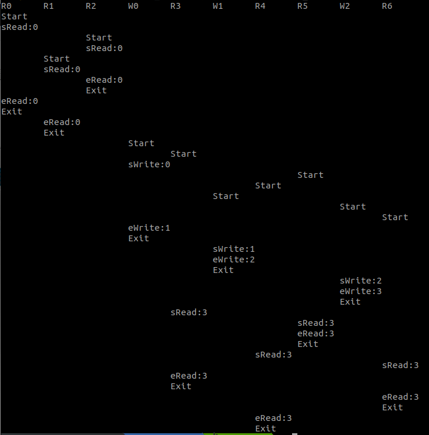
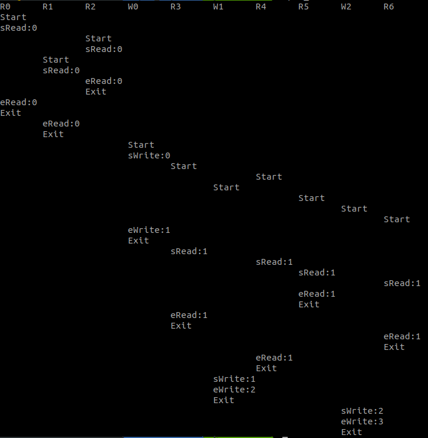

## Simple RW-Lock Implementation

+ Implemented class `RWLockSemaphore`(Reader-first, via Semaphore), `RWLockCond`(Writer-first, via Condition Variable)
+ Using standard C++ threading and sync mechanisms

```bash
g++ writer_first.cpp -o writer -lpthread -DREAD_FIRST ## use Semaphore
g++ writer_first.cpp -o writer -lpthread ## No defs, use Condition Vars (default)
```

### Tests

#### Condition Vars



#### Semaphore

